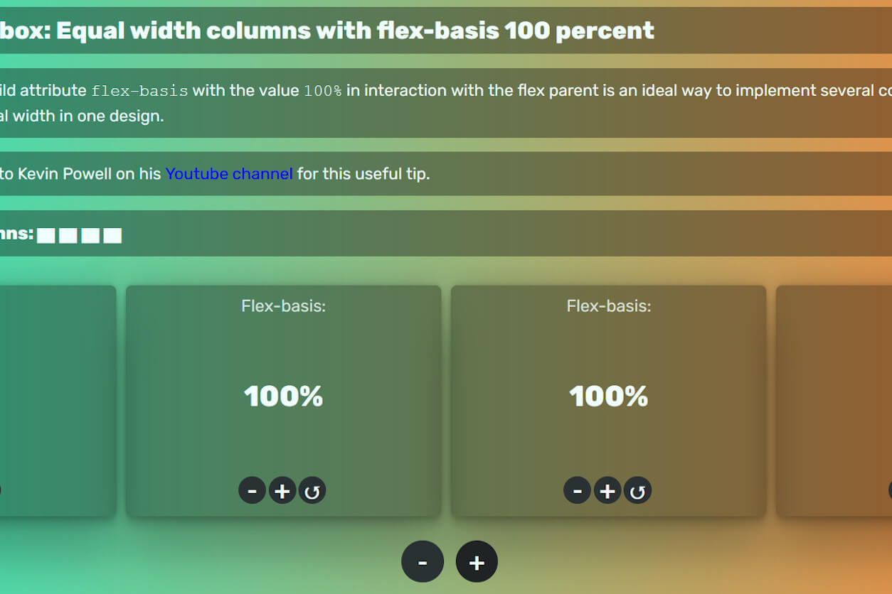

# Flexbox with equal-width columns (React App)

A way to get equal-width columns in CSS is to set the parent element to `display: flex` and the child element to `flex-basis: 100%`. React provides a vivid way to demonstrate this useful effect with some fancy animation using window.requestAnimationFrame().

[CodePen Demo](https://codepen.io/tuedodev/pen/gOLmrBP)
